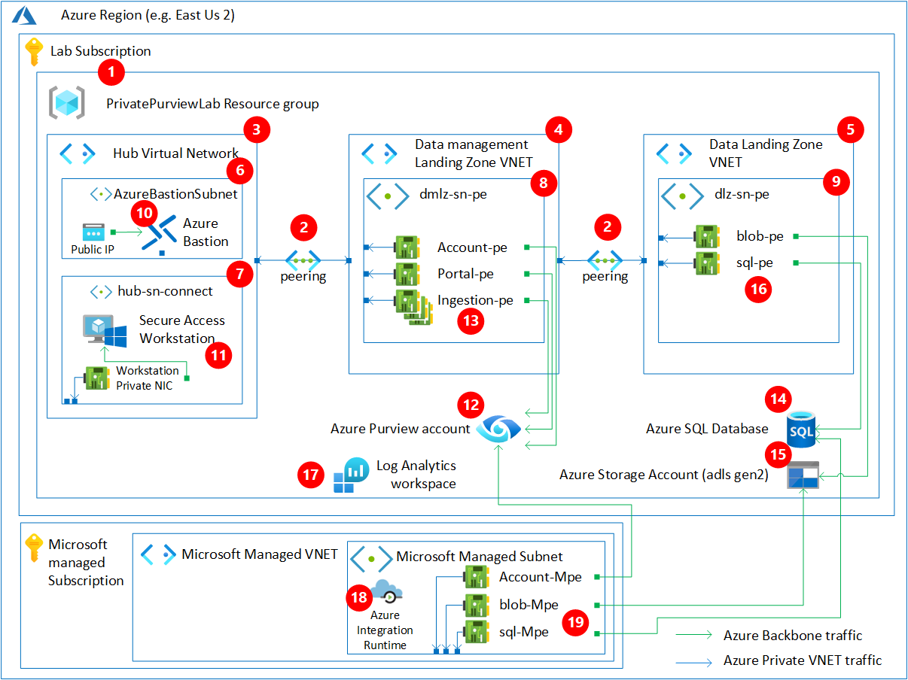

# Environment description and architecture

## Overview

The goal here is to simulate a bare bone environment that approximates the main components you would find in deployments that follow the [Cloud Adoption framework](https://docs.microsoft.com/azure/cloud-adoption-framework/) and require a private access. For the sake of learning and exposure to more restrictive guidelines. To that end, the following area of interest are included in the architecture:

- Simulating a hub and spoke network that includes a Hub virtual network, a Data management Landing zone virtual network and a Data Landing zone virtual network.
- The above three virtual network will be peered to simulate a typical deployment
- All deployed services will make use of private endpoints
- The Purview service will be using the Managed VNET feature to scan the data source using private network traffic
- Simulating a fully private "secure access workstation" involving spinning up a virtual machine that is fully private (i.e. not accessible from the internet)
- Leveraging the Azure Bastion Service to handle the public facing handshake.
- [Optional] Enable a feature of Azure Cloud Defender called Just in time access to limit the attack surface of the Virtual machine.

This will simulate the most stringent of standards that you may encounter in the field and how Azure can address those requirements.

## Architecture diagram

| Architecture element  | Description |
| ------------- | ------------- |
| 1- Subscription and Resource group  | This lab recommends to create one resource group to hold all our elements for easy of deployment and cleaning up  |
| 2- Virtual network peerings  | This lab will attempt to simulate a real network setup that you would encounter in the field. Thus we are creating three virtual network to simulate three distinct subscription. We are peering all three of them to simulate a data mesh architecture |
| 3- Virtual networks | We will create three peered virtual network. The hub network, the Data Management Landing zone Network and the Data Landing zone network. Please see [Setting up the simulated network and secure access workstation](/modules/module01.md) for details. |
